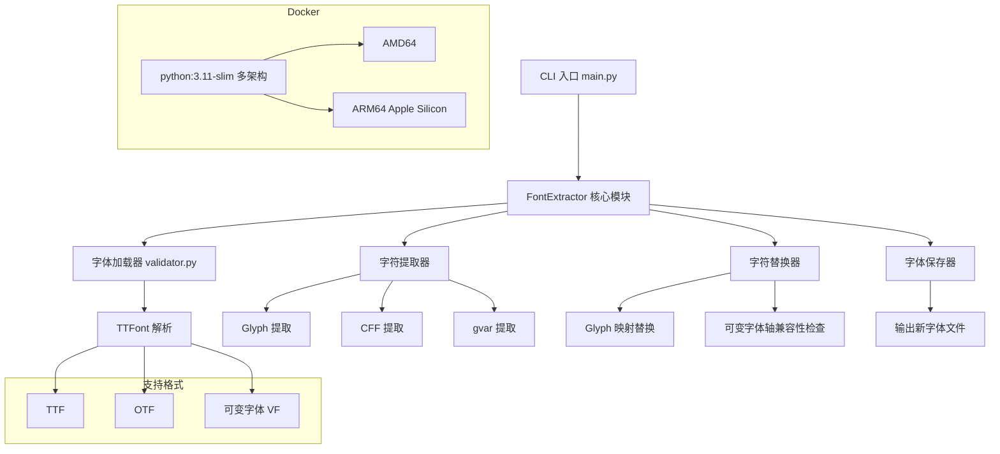
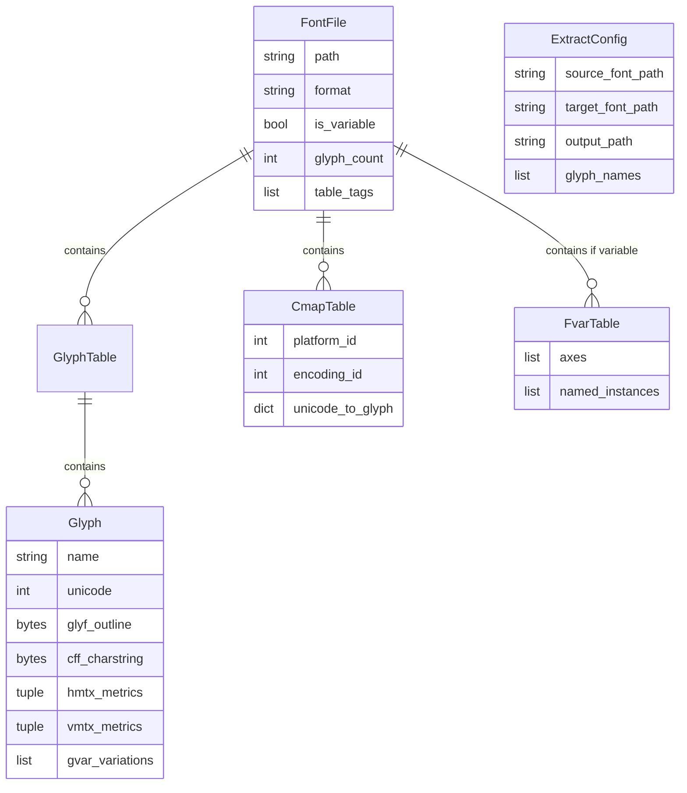

# 字体字符提取替换工具 - 设计文档

## 1. 系统架构



## 2. 数据模型



## 3. 核心接口清单

### CLI 命令 (main.py)

| 命令 | 参数 | 说明 |
|------|------|------|
| `extract` | `-s SOURCE -t TARGET -o OUTPUT [-g GLYPHS]` | 从源字体提取字符并替换到目标字体 |
| `info` | `FONT_PATH` | 显示字体文件信息 |
| `check` | `FONT_PATH [-g GLYPHS]` | 检查字体中是否包含指定字符 |
| `list-glyphs` | 无 | 显示默认提取的字符列表 |

### FontExtractor 类 (font_extractor.py)

| 方法 | 参数 | 返回值 | 说明 |
|------|------|--------|------|
| `load_source_font()` | font_path: str | self | 加载源字体 |
| `load_target_font()` | font_path: str | self | 加载目标字体 |
| `extract_glyphs()` | glyph_names, progress_callback | Dict | 提取指定字符 |
| `replace_glyphs()` | glyphs_data, progress_callback | self | 替换字符到目标字体 |
| `save()` | output_path: str | Path | 保存修改后的字体 |
| `close()` | 无 | None | 关闭字体文件 |
| `get_extraction_report()` | 无 | Dict | 获取提取报告 |

### 便捷函数

| 函数 | 说明 |
|------|------|
| `extract_and_replace()` | 一键提取和替换，封装完整流程 |

### 验证模块 (validator.py)

| 函数 | 说明 |
|------|------|
| `validate_font_path()` | 验证字体文件路径和格式 |
| `validate_font_file()` | 验证并加载字体文件 |
| `validate_glyphs_exist()` | 验证字符是否存在于字体中 |
| `validate_output_path()` | 验证输出路径 |
| `is_variable_font()` | 检查是否为可变字体 |

## 4. 支持的字符列表（90个）

```
exclamdown cent sterling exclam quotedbl numbersign dollar percent 
ampersand quotesingle parenleft parenright asterisk plus comma 
hyphenminus period slash glyph22~glyph31 colon semicolon less equal 
greater question at A-Z bracketleft backslash bracketright 
asciicircum underscore grave a-z braceleft bar braceright asciitilde
```

## 5. 技术选型

| 技术 | 版本 | 用途 |
|------|------|------|
| Python | 3.11 | 运行环境 |
| fonttools | 4.47.0 | 字体解析和操作 |
| click | 8.1.7 | 命令行接口 |
| loguru | 0.7.2 | 日志记录 |

## 6. Docker 部署

| 项 | 值 |
|------|------|
| 基础镜像 | `python:3.11-slim` |
| 构建方式 | 多阶段构建（builder + runtime） |
| 支持架构 | linux/amd64, linux/arm64 |
| Apple Silicon | 支持（M1/M2/M3） |
| PyPI 镜像 | 阿里云 |

验证 ARM 架构支持：
```bash
docker pull --platform linux/arm64 python:3.11-slim
```
